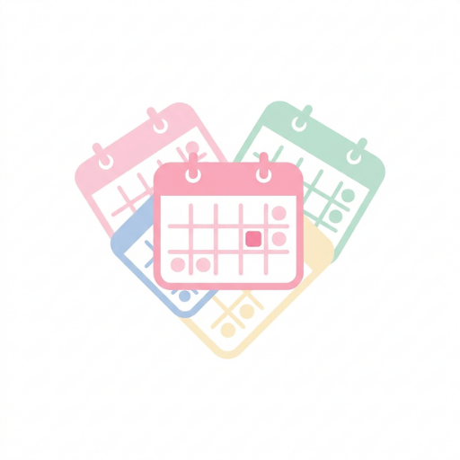
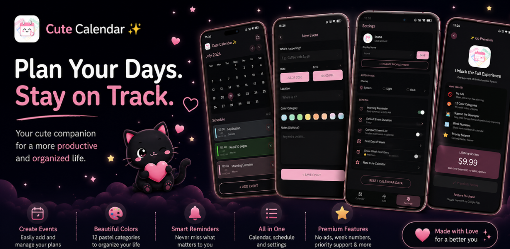
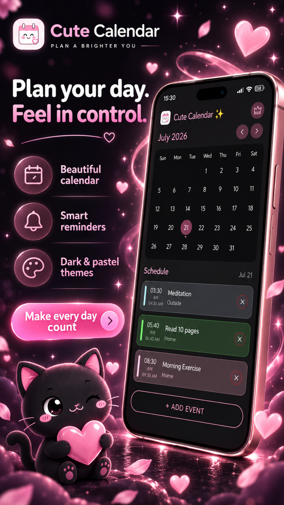
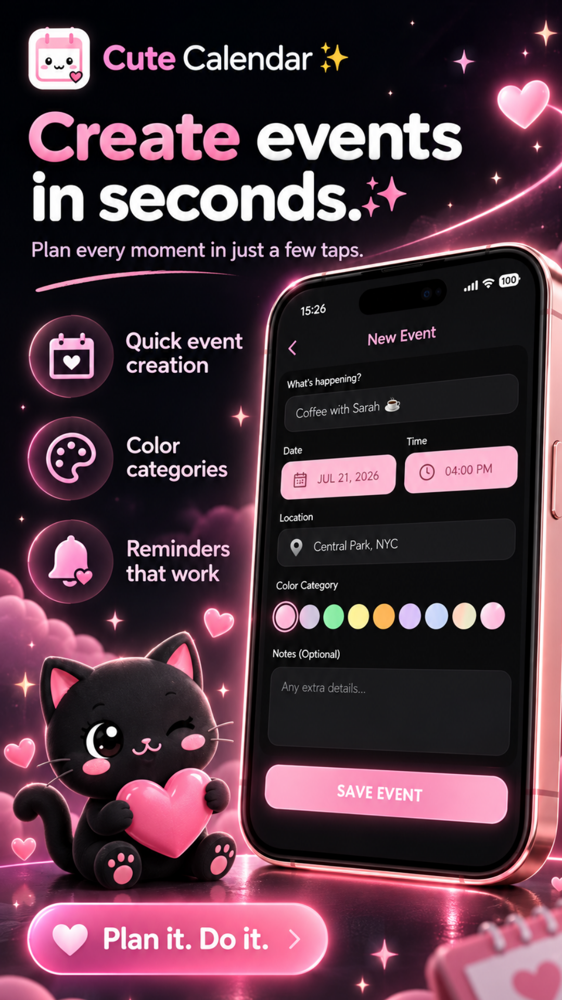
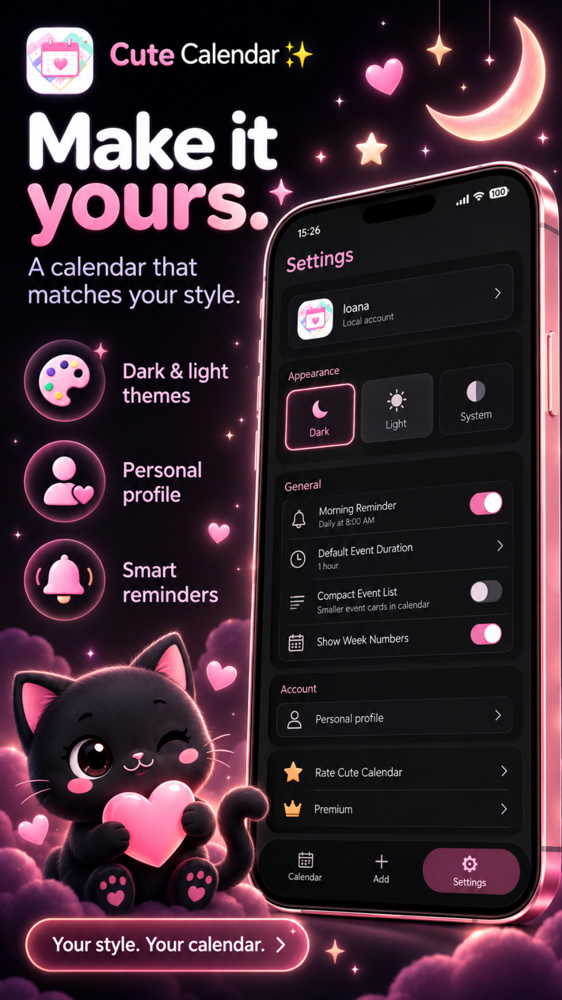
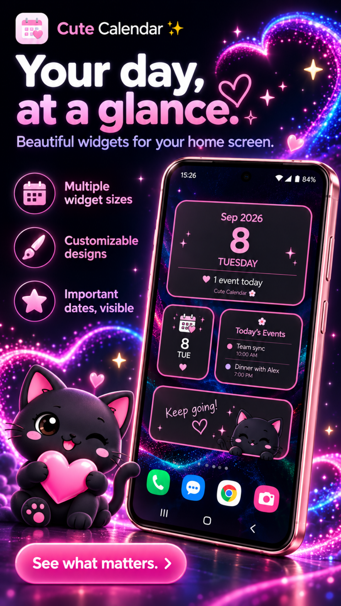
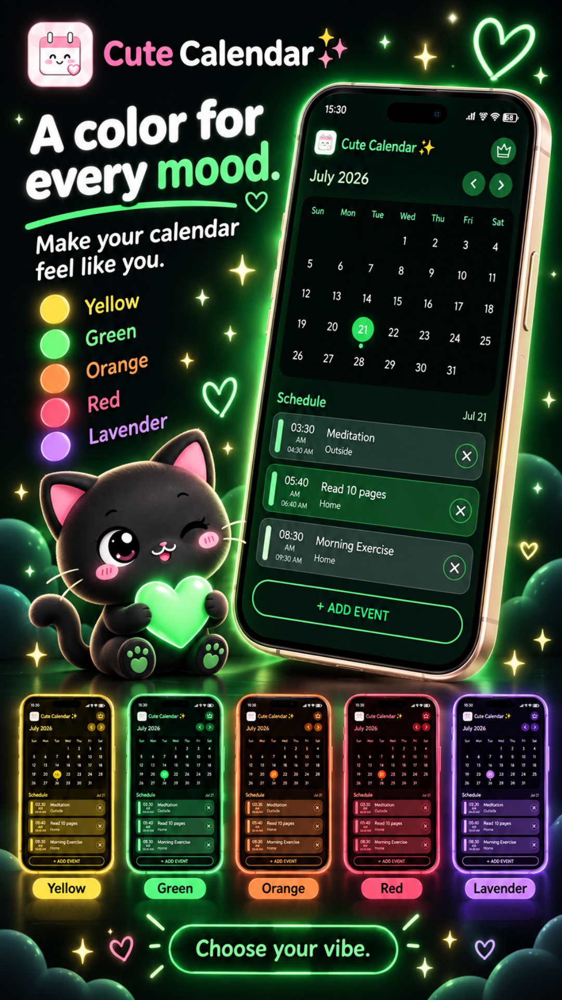
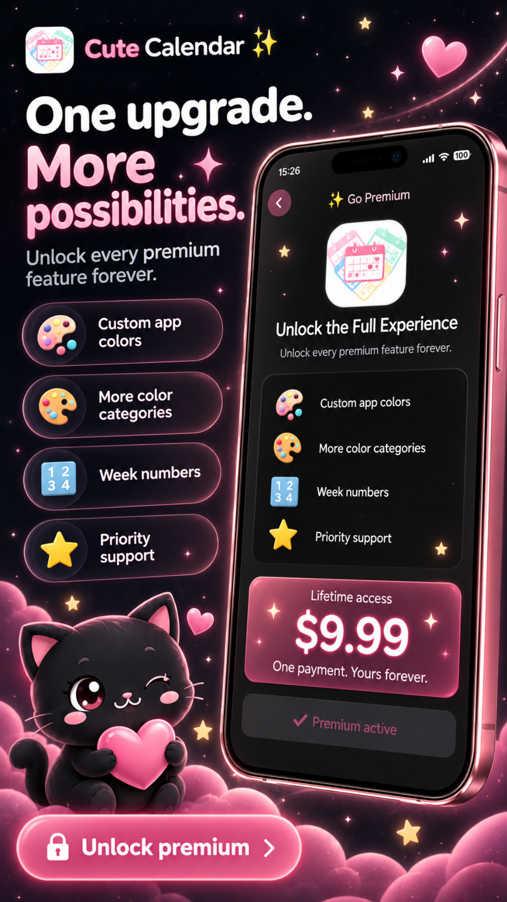

# 📅 Cute Calendar

### Beautiful Planner & Event Tracker for Android

**A minimal, elegant calendar app for your daily life.**  
Clean. Fast. Free with optional Premium and ad-free Supporter tiers.

---

---

## 📅 About Cute Calendar

**Cute Calendar** is a beautiful, minimal Android planner designed for everyday use.  
It provides a monthly calendar view, color-coded events, morning reminders, home screen widgets, and a clean schedule view — all in a lightweight, privacy-respecting package.

> ### 📢 Free App — Supported by Advertising
> Cute Calendar is free and supported by **Google AdMob** advertising.  
> **Premium Lifetime**, **Supporter**, and **Remove Ads** purchases remove all ads permanently.  
> Premium unlocks extra features such as week numbers and all 12 color categories.

---

## ✨ Features

### 📆 Calendar & Events
- Monthly calendar grid with smooth navigation
- Tap any day to see your schedule
- Add, edit, and delete events with title, date, time, location, and notes
- **12 color categories** for visual organization
- Dot indicators on days that have events
- Compact or comfortable event list view

### ⏰ Reminders & Notifications
- Daily **8:00 AM morning reminder** with that day's events
- Local notifications — no remote server required
- Works after device restart (alarm chain rescheduling)
- Notification help guide for battery-optimized devices

### 📱 Home Screen Widgets
| Widget | Description |
|---|---|
| **Calendar Widget** | Monthly mini-calendar with event dots |
| **Events Widget** | Today's event list at a glance |

Both widgets auto-update at midnight and refresh on event changes.

### 🎨 Appearance
- Light, Dark, and System theme support
- Compact event list toggle
- First day of week: Sunday or Monday
- Custom profile name and photo
- **Custom app launcher icons** (Supporter feature)

### 👑 Premium Features
- Week numbers in calendar grid
- All 12 color categories
- Remove all advertising
- Custom app icons
- Priority support

---

## 👑 Premium & Pricing

Cute Calendar is **free** and supported by Google AdMob advertising.  
All paid tiers are optional.

### One-Time Purchases

| Product | Description |
|---|---|
| ⭐ **Premium Lifetime** | All Premium features permanently. Lifetime badge + exclusive app icons. |
| 🚫 **Remove Ads** | Removes all advertising permanently. One-time purchase. |

### Subscriptions

| Product | Benefits |
|---|---|
| 🏆 **Supporter Monthly** | Removes all ads · Custom app icons · Supporter badge |

> Prices, taxes, and availability are displayed by Google Play before purchase.

---

## 🛡️ Privacy

Cute Calendar is built with **privacy as a core principle:**

| | |
|---|---|
| 📢 | Google AdMob advertising shown to free users (GDPR consent required) |
| ✅ | Supporter / Remove Ads removes all advertising permanently |
| ✅ | All events and preferences stored **locally on your device** |
| ❌ | No cloud sync or developer-operated backup server |
| ❌ | No analytics or crash-reporting SDKs |
| ✅ | Purchases managed by Google Play + RevenueCat (anonymous ID only) |
| ✅ | GDPR, CCPA, and U.S. state privacy law compliant |

→ **[Full Privacy Policy](./PRIVACY_POLICY.md)**

---

## 🔗 Download

**[play.google.com/store/apps/details?id=com.cutecalendardc.app](https://play.google.com/store/apps/details?id=com.cutecalendardc.app)**

---

## 📄 Legal Documents

| Document | Description |
|---|---|
| [Privacy Policy](./PRIVACY_POLICY.md) | How we handle (and don't handle) your data |
| [Terms of Use](./TERMS_OF_SERVICE.md) | Rules for using Cute Calendar |
| [License](./LICENSE) | Proprietary software license |
| [Security Policy](./SECURITY.md) | How to report vulnerabilities |
| [Changelog](./CHANGELOG.md) | Version history |
| [Support](./SUPPORT.md) | Help and contact information |

---

## 👤 Developer

**Denis Casian** — Independent developer, Romania 🇷🇴

| | |
|---|---|
| 🌐 Website | [deniscasian.com](https://deniscasian.com) |
| 📧 Support | [support@deniscasian.com](mailto:support@deniscasian.com) |
| 🐛 Bug Reports | [bugs.deniscasian.com](https://bugs.deniscasian.com) |
| 📱 App | [Google Play](https://play.google.com/store/apps/details?id=com.cutecalendardc.app) |
| 📱 All Apps | [apps.deniscasian.com](https://apps.deniscasian.com) |

---

Made with 💜 for everyone who loves a clean, organised life.

**[Download Cute Calendar](https://play.google.com/store/apps/details?id=com.cutecalendardc.app)** ·
**[Privacy Policy](./PRIVACY_POLICY.md)** ·
**[Terms of Use](./TERMS_OF_SERVICE.md)**

*© 2026 Cute Calendar. All rights reserved.*

